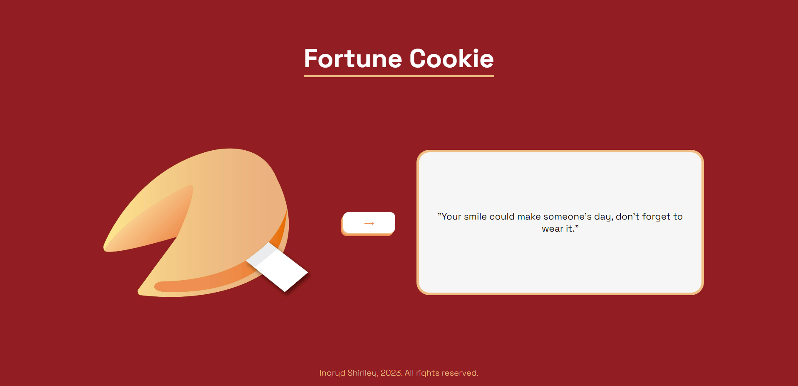

|      MOBILE         |          DESKTOP       |
|:-------------------:|:-----------------------:
|||
|                     |                        |  

## Sobre:
O objetivo deste projeto é colocar em prática os conhecimentos sobre FrontEnd.

---

## Tecnologias utilizadas:
- CSS
- HTML
- Markdown
- JavaScript
- Responsividade
---

## **Autora**

| NOME                                                                                                                                                                                      |                                                     GITHUB                                                      |                                       FOTO                                       |
| :----------------------------------------------------------------------------------------------------------------------------------------------------------------------------------------- | :-------------------------------------------------------------------------------------------------------------: | :------------------------------------------------------------------------------: |
|  |      | </a> |
